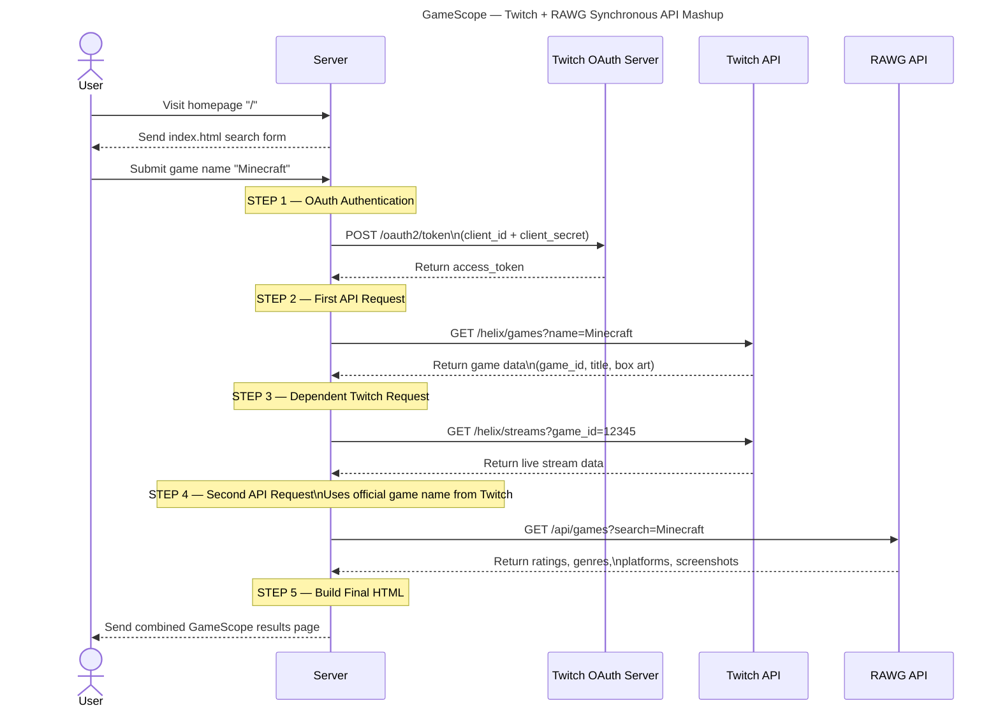

```mermaid
sequenceDiagram
    title GameScope — Twitch + RAWG Synchronous API Mashup

    actor User
    participant Server
    participant TwitchOAuth as Twitch OAuth Server
    participant TwitchAPI as Twitch API
    participant RAWGAPI as RAWG API

    User->>Server: Visit homepage "/"
    Server-->>User: Send index.html search form

    User->>Server: Submit game name "Minecraft"

    Note over Server: STEP 1 — OAuth Authentication

    Server->>TwitchOAuth: POST /oauth2/token\n(client_id + client_secret)
    TwitchOAuth-->>Server: Return access_token

    Note over Server: STEP 2 — First API Request

    Server->>TwitchAPI: GET /helix/games?name=Minecraft
    TwitchAPI-->>Server: Return game data\n(game_id, title, box art)

    Note over Server: STEP 3 — Dependent Twitch Request

    Server->>TwitchAPI: GET /helix/streams?game_id=12345
    TwitchAPI-->>Server: Return live stream data

    Note over Server: STEP 4 — Second API Request\nUses official game name from Twitch

    Server->>RAWGAPI: GET /api/games?search=Minecraft
    RAWGAPI-->>Server: Return ratings, genres,\nplatforms, screenshots

    Note over Server: STEP 5 — Build Final HTML

    Server-->>User: Send combined GameScope results page
```
